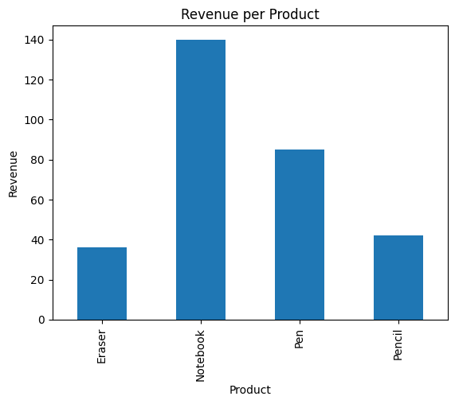

# 📊 Task 7 – Basic Sales Summary using SQLite & Python

## 🧠 Objective
Use SQL inside Python to pull simple sales info like **total quantity sold** and **total revenue per product**, and visualize the results using a bar chart.

## 🛠 Tools Used
- Python
- SQLite (via `sqlite3`)
- Pandas
- Matplotlib
- Jupyter Notebook

## 📂 What This Project Does
1. Creates a SQLite database file (`sales_data.db`) with a `sales` table.
2. Inserts sample sales data for products like Pens, Pencils, Notebooks, etc.
3. Runs a SQL query to compute:
   - Total quantity sold per product
   - Total revenue per product
4. Loads results into a Pandas DataFrame.
5. Displays the results using:
   - `print()` in the terminal
   - A bar chart (`matplotlib`) showing revenue per product.
6. Saves the chart as `sales_chart.png`.

## 📸 Output Screenshot

## 💡 Learning Outcome
- How to integrate SQL with Python using SQLite
- Use of `pandas.read_sql_query()`
- Basic SQL operations like `GROUP BY` and `SUM()`
- Visualizing data using matplotlib
